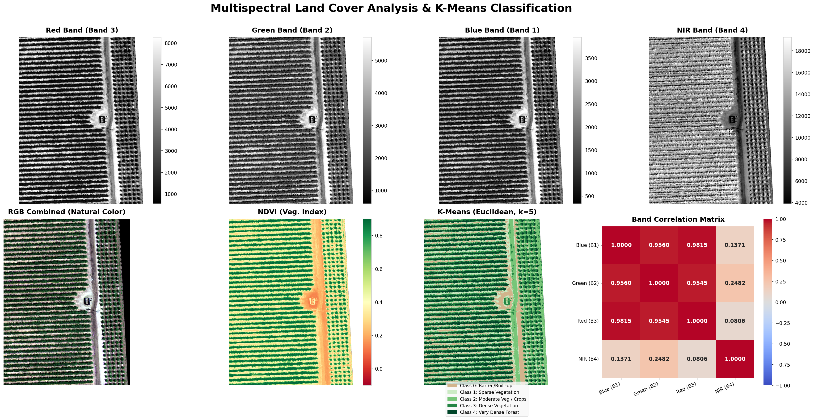

# Çok Bantlı Görüntülerde K-Means Kümeleme ile Arazi Örtüsü Sınıflandırması

Bu proje, **BMI3242 Remote Sensing Technologies (Uzaktan Algılama Teknolojileri)** dersi kapsamında hazırlanmış bir ödev uygulamasıdır. Proje, 4 bantlı (multispectral) uydu görüntüsünü (`multispectral.tif`) işleyerek **K-Means Kümeleme** algoritması ile arazi örtüsü sınıflandırması yapar, NDVI ve korelasyon matrisi analizlerini sunar.



---

## Ödev Gereksinimleri (Assignment Requirements)

1. **K-Means Kümeleme**: `sklearn.cluster.KMeans` sınıfı kullanılarak arazi örtüsü sınıflandırması yapılması ($k=5$).
2. **Çok Bantlı Görüntü Yapısı**: Görüntünün Mavi, Yeşil, Kırmızı ve Yakın Kızılötesi (NIR) olmak üzere 4 banda sahip olduğunun kabul edilmesi.
3. **Mesafe Ölçütü**: Benzerliği ölçmek için **Öklid (Euclidean) mesafesinin** kullanılması.
4. **Analiz Çıktıları**: Projenin çıktı olarak aşağıdaki 8 bileşeni görselleştirmesi ve kaydetmesi:
   - Kırmızı Bandı (Red Band)
   - Yeşil Bandı (Green Band)
   - Mavi Bandı (Blue Band)
   - Yakın Kızılötesi Bandı (NIR Band)
   - RGB Birleşimi (RGB Combined - Doğal Renk Görüntüsü)
   - Öklid Mesafeli K-Means Sınıflandırma Haritası
   - Bantlar Arası Korelasyon Matrisi (Correlation Matrix)
   - NDVI (Normalize Edilmiş Fark Bitki İndeksi) Haritası

---

## Kritik Çıkarımlar (Key Insights)

### 1. NIR Bandının Bağımsızlığı ve Spektral İmza İlişkisi
Analiz sonucunda, Yakın Kızılötesi (NIR) bandının görünür bölge (Kırmızı, Yeşil, Mavi) bantlarıyla olan korelasyonu son derece düşük çıkmıştır (özellikle Kırmızı ile **~0.08**).
* **Neden?** Yeşil bitki örtüsünün spektral imzası (spectral signature) gereği, bitkiler fotosentez için görünür ışığı (özellikle kırmızı ve mavi dalga boylarını) soğururken (absorbe ederken), yaprak içi hücresel yapısı (mesofil hücreleri) nedeniyle Yakın Kızılötesi (NIR) ışınlarını son derece güçlü bir şekilde yansıtır. Görünür bölge bantları kendi aralarında yüksek korelasyon gösterirken (>0.95), NIR bandı tamamen bağımsız bir davranış sergiler. Bu bağımsızlık, arazi örtüsü sınıflandırmasında bitki örtüsünü çıplak toprak ve kentsel yapılardan ayıran en önemli ayırt edici özelliktir.

### 2. NDVI Tabanlı Küme Sıralaması (Fiziksel Anlamlandırma)
Klasik K-Means algoritmaları, başlangıç merkezlerinin rastgele seçilmesinden dolayı her çalıştırıldığında küme etiketlerini (0, 1, 2, 3, 4) rastgele dağıtır.
* **Çözüm:** Bu projede, küme merkezleri elde edildikten sonra her bir kümenin ortalama NDVI değerleri hesaplanmıştır. K-Means etiketleri NDVI ortalamasına göre **küçükten büyüğe (0'dan 4'e)** yeniden sıralanmıştır. Bu sayede:
  - **Sınıf 0 (En Düşük NDVI ~0.289)**: Çıplak toprak, yollar ve yapay yüzeyleri,
  - **Sınıf 4 (En Yüksek NDVI ~0.851)**: En yoğun ve sağlıklı ormanlık alanları/bitki örtüsünü temsil edecek şekilde fiziksel bir anlam kazanmıştır.

---

## Mühendislik Çözümleri

Programın kararlı, bilimsel olarak doğru ve yüksek kaliteli sonuçlar üretmesi için aşağıdaki mühendislik teknikleri uygulanmıştır:

* **Veri Maskeleme (No-Data Masking)**: Çok bantlı görüntülerin etrafında yer alan ve veri içermeyen siyah boşlukların (0 değerleri) K-Means modelini ve korelasyon matrisini bozmasını engellemek amacıyla bir maske uygulanmıştır. Sadece 4 bandında da 0'dan büyük değere sahip geçerli pikseller analize dahil edilmiş, arka plan pikselleri görselleştirmede şeffaf/etkisiz hale getirilmiştir.
* **Veri Standartlaştırma (Feature Scaling)**: Öklid mesafesini temel alan K-Means algoritmasında, sayısal aralığı çok geniş olan NIR bandının (~25,000) görünür bölge bantlarına (~1,500) baskın gelmesini önlemek amacıyla, kümeleme öncesinde `StandardScaler` kullanılarak veriler normalize edilmiştir. Analiz sonrasında küme merkezleri `inverse_transform` ile gerçek yansıma değerlerine geri dönüştürülmüştür.
* **Kontrast Artırımı (Contrast Stretching)**: Orijinal 16-bitlik karanlık multispectral görüntü piksellerini insan gözünün görebileceği şekilde netleştirmek için **%2−%98 percentile clipping (yüzdelik kırpma)** tekniği uygulanarak yansıma değerleri normalize edilmiştir.
* **Sıfıra Bölünme Koruması (Zero-Division Prevention)**: NDVI hesabı yapılırken ($(\text{NIR}-\text{Red})/(\text{NIR}+\text{Red})$), paydanın 0 olduğu durumlarda programın çökmesini önlemek için numpy `np.errstate` ve koşullu maskeleme kullanılarak güvenli bölme işlemi gerçekleştirilmiştir.

---

## Arazi Örtüsü Küme İstatistikleri (Cluster Statistics)

K-Means sınıflandırması sonrasında elde edilen 5 arazi örtüsü sınıfının istatistiksel detayları:

| Sınıf | Ortalama NDVI | Piksel Sayısı | % Kaplama Oranı | Temsil Ettiği Arazi Örtüsü | Ortalama Yansıma Değerleri (Mavi, Yeşil, Kırmızı, NIR) |
|---|---|---|---|---|---|
| **Sınıf 0** | 0.289 | 278,902 | 12.97% | Çıplak toprak, kuru beton, yollar | (3444.2, 5088.4, 7556.2, 13687.6) |
| **Sınıf 1** | 0.387 | 381,051 | 17.72% | Kuru otlaklar ve parlak toprak alanları | (2518.9, 3870.0, 5671.2, 12841.6) |
| **Sınıf 2** | 0.405 | 417,212 | 19.41% | Seyrek bitki örtüsü, kentsel yeşil alanlar | (1787.3, 2792.2, 3932.7, 9278.5) |
| **Sınıf 3** | 0.723 | 421,704 | 19.61% | Çalılıklar, tarım arazileri / ürünler | (616.7, 1161.0, 1167.0, 7269.3) |
| **Sınıf 4** | 0.851 | 651,043 | 30.28% | Yoğun ve sağlıklı orman kanopisi | (826.8, 1803.2, 1241.7, 15472.8) |

---

## Bantlar Arası Korelasyon Matrisi (Correlation Matrix)

Bantlar arası Pearson korelasyon katsayıları, görünür bölge bantlarının (Mavi, Yeşil, Kırmızı) kendi aralarında çok yüksek korelasyon gösterdiğini (>0.95), NIR bandının ise görünür bölgeden bağımsız olduğunu kanıtlar:

| Bant | Mavi (B1) | Yeşil (B2) | Kırmızı (B3) | NIR (B4) |
|---|---|---|---|---|
| **Mavi (B1)** | 1.0000 | 0.9560 | 0.9815 | 0.1371 |
| **Yeşil (B2)** | 0.9560 | 1.0000 | 0.9545 | 0.2482 |
| **Kırmızı (B3)** | 0.9815 | 0.9545 | 1.0000 | 0.0806 |
| **NIR (B4)** | 0.1371 | 0.2482 | 0.0806 | 1.0000 |

---

## Kurulum ve Çalıştırma Talimatları (Getting Started)

### Gereksinimler (Prerequisites)
Sisteminizde Python 3.10 veya üzeri bir sürüm kurulu olmalıdır. Gerekli kütüphaneleri yüklemek için aşağıdaki komutu çalıştırabilirsiniz:

```bash
pip install numpy rasterio matplotlib seaborn scikit-learn pandas
```

### Çalıştırma Adımları
1. Bu depoyu yerel bilgisayarınıza klonlayın veya indirin.
2. Sınıflandırılacak olan çok bantlı görüntüyü (`multispectral.tif`) projenin ana dizinine yerleştirin.
3. Terminal veya komut istemcisini açıp proje dizinine gidin ve aşağıdaki komutla uygulamayı başlatın:

```bash
python classify_land_cover.py
```

Uygulama çalıştıktan sonra grafik paneli pencerede görüntülenecek ve aynı zamanda `land_cover_classification.png` dosyası olarak kaydedilecektir.
